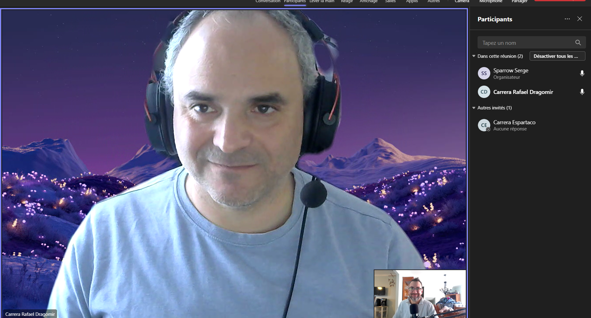
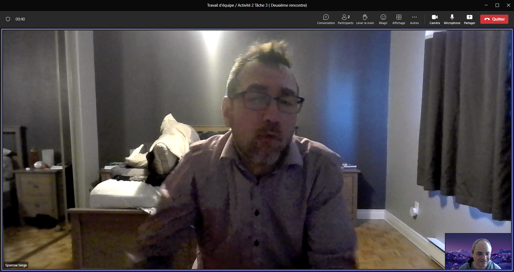

# Introduction

Pour certains, communiquer oralement de manière efficace c'est beaucoup plus que prononcer des mots. C'est un acte dynamique fait d'échanges de regards, de sourires, de variations d'intonation ou de débit, etc. [@granger2022]. D'ailleurs, quand je faisais des sondages téléphoniques, le formateur nous avait suggéré de sourire au téléphone: Il prétendait que ce sourire invisible, mais perceptible pour notre interlocuteur, rendrait nos clients plus réceptifs à nos demandes. Alors, pour améliorer notre pratique enseignante, nous analyserons différents aspects de notre communication orale en situation d'enseignement. Pour y parvenir, nous dresserons un résumé de notre autoévaluation. Par la suite, nous soulignerons les moyens qui pourraient, dans la durée, améliorer notre communication orale. Après, nous décrirons le rôle des technologies de l'information dans notre communication orale. Enfin, nous comparerons nos approches communicationnelles et soulignerons l'apport de cet exercice à notre formation en enseignement professionnel.

# Une autoévaluation

Dans notre communication orale, parmi nos qualités nous avons constaté que nous parlions calmement et que nous avions un débit posé qui n'ennuyait pas et qui n'accablait pas notre auditoire. Serge a même souligné qu'on lui avait fait remarquer que sa voix avait un timbre *radiophonique*. Nous avons aussi estimé que le fait d'improviser à partir d'un plan bien défini donnait une vivacité à notre discours que la lecture seule aurait été incapable de produire. En plus, cette approche *improvisée* implique davantage l'engagement des étudiants, parce que l'évolution du discours suit le flux naturel qui naît des interactions verbales et non verbales entre l'enseignant et les élèves. Enfin, nous avons remarqué que nous utilisions les anglicismes uniquement dans la mesure où ils étaient dominants dans l'industrie. Par exemple, en arpentage pour spécifier sur les piquets la quantité de matériau qu'il faut additionner ou soustraire pour atteindre un niveau voulu, on emploiera plus souvent les termes *cut* et *fill* que les équivalents français **déblai** ou **remblai**.

# Les moyens d'amélioration de la communication orale dans la durée

Nous avons déterminé les moyens suivants pour améliorer notre communication orale dans la suite de notre carrière d'enseignant. Certains correctifs peuvent être mis en place immédiatement; d'autres seront en développement tout au long de notre carrière d'enseignant.

## Court terme

Dans l'immédiat, un moyen efficace d'améliorer notre communication serait d'exclure de toute communication les anglicismes *non nécessaires*. En adoptant cette posture, on serait en accord avec la compétence professionnelle 2 des enseignants et on inscrirait notre communication pleinement dans "l'univers symbolique" québécois [@ministeredeleducation2020, 50].

## Moyen terme

Dans le moyen terme, on pourrait à l'occasion s'enregistrer et s'autoévaluer comme nous l'avons fait dans la tâche 2. Cet exercice périodique nous permettrait de rester humbles en évitant l'autosatisfaction qui vient avec la routine. Par ailleurs, nous pourrions aussi nous placer en situation d'écoute active [@lecentrefranco-ontarienderessourcespedagogiques2015, 17] en assistant aux cours donnés par nos collègues. Cet exercice, que j'ai eu la chance de pratiquer, nous permet de confronter nos stratégies de communication avec les leurs et, le cas échéant, nous inspirer de leur exemple. Enfin, nous pourrions inviter le conseiller pédagogique de notre établissement pour qu'il vienne évaluer notre communication orale et pour nous fournir des pistes d'amélioration.

## Long terme

À long terme, un des meilleurs moyens d'améliorer son habileté en communication orale passe par la maîtrise de la compétence. Car plus l'enseignant domine la matière enseignée, plus il parvient à situer une compétence dans la formation et en regard du métier. Plus il s'approprie les outils didactiques et techniques pour l'enseigner, plus il aura de la facilité à transférer ses connaissances oralement [@gagnon2016, 153-161]. Afin d'y parvenir, mon collègue, dresse un bilan de ses atteintes d'objectifs sous forme de journal à la fin de chaque module. Il établit également un thésaurus des termes nécessaires aux modules: ceci est un moyen excellent pour s'approprier la liste des savoirs à enseigner. Enfin, nous croyons qu'il serait profitable de personnaliser notre communication avec les élèves en situation de handicap: par exemple, en passant une communication de groupe à une communication personnelle. 

# Utilisation des TIC

Dans nos domaines respectifs, les technologies de l'information ne jouent pas un rôle prépondérant. Certains peuvent le souhaiter, mais je me souviens encore combien mes enfants étaient découragés par les cours à distance pendant la pandémie: ils s'ennuyaient et décrochaient après cinq minutes. Pourtant, ils peuvent passer la journée entière collés aux écrans. L'aspect social de l'école et les interactions avec leurs camarades devaient leur manquer.
Dans mon école, l'enseignement à distance, même pendant la pandémie, a été peu utilisé. D'ordinaire, l'enseignement se fait en présentiel et les élèves travaillent par équipes. Nous avons pratiqué l'enseignement à distance pour les modules qui se déroulaient uniquement à l'ordinateur (par exemple, le module 14: *Conversion de données d'arpentage*). C'était une formule hybride où certains élèves venaient en classe et ceux qui le désiraient se connectaient à un réseau virtuel privé et suivaient la leçon sur **Teams**. Cette approche n'influait pas la forme de la communication orale: l'interaction avec les élèves restait la même en dépit de la distance.
D'un autre côté, je pratique encore peu l'enseignement asynchrone par le biais de capsules vidéo, mais je suis prêt à franchir le pas dans l'avenir. Toutefois, si j'en faisais, ces capsules devraient être plus des aide mémoire que des leçons.

# Comparaison des moyens de communication

Nos moyens de communication sont sensiblement les mêmes, mais s'ils prennent à l'occasion des aspects différents. Nous reconnaissons tous les deux qu'une bonne préparation et une bonne planification sont indispensables à une bonne communication orale. Ensuite, nous sommes d'avis qu'il faille livrer notre message avec assurance et sérénité tout en gardant un œil attentif et empathique aux réactions de nos élèves pour discerner quand on doit insister sur un concept, revenir sur une notion ou s'adresser à un élève en particulier. Enfin, les stratégies d'amélioration (glossaire, journal de bord, observation de collègues) nous semblent être complémentaires et on aurait tout avantage à les exploiter dans l'avenir.

# Apport de l'analyse des méthodes de communication orale à la formation en enseignement professionnel

  Personnellement, l'intérêt principal de ce travail en équipe était celui de rompre l'isolement dans lequel on se retrouve quand on suit la formation à distance à l'**UQAR**: nous ne voyons pas nos collègues étudiants et nos contacts avec les enseignants se réduisent au minimum. J'avais déjà fait un travail en équipe, mais la nature de celui-ci est beaucoup plus satisfaisante. Échanger de vive voix avec un collègue qui partage le même vécu d'enseignant avec ses gloires et ses frustrations fut très agréable. Ce fut un déjeuner conversation comme j'en ai avec mes collègues à l'école tous les jours. Cela renforce aussi l'impression que nous appartenons à une profession et ne sommes pas seulement l'employé d'une école.

# Conclusion

Pour conclure, je dirais que ce travail a été très enrichissant parce qu'il m'a permis d'analyser un acte que je pratique quotidiennement: la communication orale. En équipe, avec mon collègue Serge Sparrow, nous avons disséqué les autoévaluations que nous avions faites sur nos communications orales en situation d'enseignement. Ensuite, nous avons discuté des moyens à notre disposition pour améliorer notre communication orale à court, moyen et long terme. Après, nous avons échangé sur la place qu'occupent les technologies de l'information et de la communication dans notre enseignement et celle qu'elles pourraient prendre dans le futur. Enfin, nous avons souligné l'apport bénéfique que cet exercice a insufflé à notre formation en enseignement professionnel et avons souligné l'espoir d'avoir plus d'exercices du même type. 

# Annexe A 

## Membres de l'équipe pour la tâche 3

| **Équipier** | **École** | **Discipline** |
| :-------: | :-------: | :-------: |
| Espartaco Carrera | École-des-métiers-du-Sud-Ouest-de-Montréal | Arpentage et topographie |
| Serge Sparrow | École-de-formation-professionnelle-de-Chateauguay | Soutien informatique |

## Dates des vidéoconférences pour la tâche 3

| **No. Rencontre** | **Date** | **De - À** |
| :-------: | :-------: | :-------: |
| 1ère | 18 février 2024 | 9h00 - 10h15 |
| 2ème | 25 février 2024 | 9h00 - 9h30 |

# Références